# Dokumentasi Lengkap Alur dan Fitur Aplikasi Rancangan Anggaran Biaya (RAB)
### PT Sertifikasi Bermutu Ketenagalistrikan (PT SBK)

---

## 1. Deskripsi Umum Sistem
Aplikasi Rancangan Anggaran Biaya (RAB) PT SBK adalah sistem informasi finansial berbasis web yang dirancang khusus untuk mendigitalisasi, mengotomatisasi, dan mengamankan seluruh siklus hidup pengelolaan anggaran pengeluaran perusahaan. Sistem ini menggantikan pencatatan manual (*spreadsheet* terpisah) dengan platform terpadu yang menjamin akuntabilitas data, transparansi persetujuan bertingkat, akurasi mutasi arus kas, serta penyusunan laporan keuangan yang instan dan profesional.

Sistem dikembangkan menggunakan arsitektur modern berbasis **Laravel (PHP)** untuk keandalan backend, **MySQL** sebagai basis data relasional, **Tailwind CSS** untuk antarmuka pengguna (UI/UX) yang premium, serta **Chart.js** untuk visualisasi analitik interaktif.

---

## 2. Aktor Sistem dan Hak Akses (RBAC)
Sistem menerapkan kontrol akses berbasis peran (*Role-Based Access Control* / RBAC) yang ketat untuk menjamin keamanan operasional:

```mermaid
graph TD
    A[Aktor Sistem] --> B(Admin Keuangan)
    A --> C(Manajer Operasional)
    A --> D(Direktur)

    subgraph "Admin Keuangan"
    B1[Buat, Edit, & Hapus RAB]
    B2[Ajukan RAB & Notifikasi WhatsApp]
    B3[Realisasi Pembayaran & Upload Bukti <100KB]
    B4[Kolaborasi Catatan Diskusi]
    B5[Ekspor PDF Detail RAB]
    B --> B1 & B2 & B3 & B4 & B5
    end

    subgraph "Manajer Operasional (Pool System)"
    C1[Review Pengajuan Bersama]
    C2[Persetujuan Tahap 1 & Catatan Revisi]
    C3[Pencatatan Buku Arus Kas Masuk]
    C4[Kolaborasi Catatan Diskusi]
    C5[Ekspor Rekap Laporan Keuangan]
    C --> C1 & C2 & C3 & C4 & C5
    end

    subgraph "Direktur"
    D1[Persetujuan Akhir & Catatan Keputusan]
    D2[Manajemen Pengguna Terproteksi & Avatar Crop]
    D3[Monitoring Arus Kas Global - Read Only]
    D4[Kolaborasi Catatan Diskusi]
    D --> D1 & D2 & D3 & D4
    end
```



### 2.1 Admin Keuangan
*   **Fungsi Utama:** Operasional harian anggaran, pembuatan & pembaruan RAB, realisasi pembayaran, dan koordinasi lapangan.
*   **Hak Akses:**
    *   Menginput pengajuan RAB baru melalui 4 skema pengeluaran dengan struktur dinamis.
    *   **Pengelolaan Fleksibel:** Mengedit pengajuan RAB pada status `DRAFT`, `DITOLAK`, dan `DIAJUKAN`. Pengeditan status `DIAJUKAN` bertindak sebagai pembaruan pengajuan ulang.
    *   **Penghapusan Aman:** Menghapus data RAB yang berstatus `DRAFT` dan `DIAJUKAN` tanpa batas waktu.
    *   **Proteksi Keamanan Role:** Aksi edit, update, dan hapus RAB dilindungi di tingkat controller secara ketat. Hanya pengguna dengan role **Admin Keuangan** (`admin_keuangan`) yang diizinkan melakukan manipulasi data ini (percobaan akses dari role lain diblokir dengan respon `403 Forbidden`).
    *   **Ajukan RAB:** Mengirimkan draf/revisi RAB ke atasan (status berubah menjadi `DIAJUKAN`).
    *   **Notifikasi WhatsApp:** Mengirimkan pesan pengajuan anggaran terformat premium secara otomatis langsung ke WhatsApp atasan (terintegrasi pada saat sukses submit form dan tombol baris tabel).
    *   **Realisasi Pembayaran:** Melakukan pencairan pembayaran untuk RAB berstatus `DISETUJUI` dengan mengunggah bukti bayar transfer bank.
        *   *Ukuran Berkas Terbatas:* Untuk efisiensi server, ukuran berkas dibatasi ketat **maksimal 100KB** (format Gambar/PDF), divalidasi langsung di sisi frontend dan backend secara *real-time*.
        *   Langkah ini **secara otomatis mencatat transaksi Dana Keluar (Kredit) pada Buku Arus Kas**.
    *   **Kolaborasi Diskusi:** Memberikan komentar/umpan balik secara langsung pada panel diskusi detail RAB.
    *   Mengunduh berkas laporan fisik pengajuan RAB tunggal ke format PDF premium.
    *   *Catatan Keamanan:* Admin Keuangan **diblokir** dari hak membuka halaman utama Buku Arus Kas (`/cash-flow`) dan tidak dapat mencatatkan uang masuk operasional secara manual demi menjaga objektivitas pembukuan.

### 2.2 Manajer Operasional (Sistem Antrean Bersama / Pool System)
*   **Fungsi Utama:** Verifikasi kelayakan anggaran secara kolektif, manajemen likuiditas saldo kas, dan pelaporan keuangan bulanan.
*   **Hak Akses:**
    *   Melihat antrean pengajuan RAB berstatus `DIAJUKAN` di dashboard bersama secara *real-time*.
    *   Memeriksa detail rincian item pengeluaran serta riwayat audit secara komprehensif.
    *   Menyetujui pengajuan (status naik menjadi `DISETUJUI_MANAJER` dan diteruskan ke Direktur).
    *   Menolak pengajuan dengan wajib menyertakan catatan alasan revisi (status kembali menjadi `DITOLAK` untuk direvisi Admin).
    *   **Buku Arus Kas:** Memiliki akses penuh untuk membuka halaman Arus Kas (`/cash-flow`), melakukan pencatatan transaksi **Dana Masuk** atau **Saldo Awal** secara manual (dilengkapi input form terformat rupiah otomatis dan upload file bukti pendukung).
    *   **Ekspor Rekap Keuangan:** Mengekspor Buku Arus Kas bulanan dan Rekapitulasi Keuangan ke format PDF premium.
    *   **Kolaborasi Diskusi:** Membaca dan mengirimkan komentar diskusi di panel detail RAB untuk arahan revisi.

### 2.3 Direktur (Otoritas Tertinggi)
*   **Fungsi Utama:** Pengawasan global arus kas, pengambilan keputusan akhir persetujuan dana anggaran, dan tata kelola akun pengguna.
*   **Hak Akses:**
    *   Melihat antrean pengajuan RAB berstatus `DISETUJUI_MANAJER` yang memerlukan keputusan akhir.
    *   Memberikan persetujuan akhir (status naik menjadi `DISETUJUI` agar siap dicairkan oleh Admin Keuangan).
    *   Menolak pengajuan (status kembali menjadi `DITOLAK` beserta catatan keputusan).
    *   **Monitoring Arus Kas:** Mengakses halaman Arus Kas (`/cash-flow`) dalam mode **Read-Only** (dapat memantau dan memfilter semua mutasi kas masuk/keluar, saldo berjalan, serta unduh bukti transfer secara langsung, namun tidak dapat menginput transaksi baru).
    *   **Manajemen Pengguna Terproteksi:** Membuka menu kelola pengguna untuk mendaftarkan akun baru, menonaktifkan akun karyawan (*toggle active status*), dan mengunggah avatar profil karyawan (mendukung crop foto). Backend secara ketat mencegah pendaftaran akun bertipe `direktur` ganda.
    *   **Kolaborasi Diskusi:** Memberikan arahan final atau keputusan tertulis pada panel diskusi detail RAB.

---

## 3. Alur Kerja Utama Sistem (Workflows)

### 3.1 Alur Pengajuan Anggaran (RAB)
```text
[Admin Keuangan]
       │
       ├─► Input Identitas Umum RAB (Nomor RAB otomatis/manual, Periode, Deskripsi)
       ├─► Pilih Kategori Pengeluaran (Tabel Dinamis otomatis menyesuaikan)
       │         ├── Biaya Operasional (Volume × Harga Satuan, Terbagi atas 5 kelompok biaya operasional)
       │         │   └─► Mendukung tampilan responsif: Tabel Desktop & Kartu Tumpuk (Card Stack) Ponsel
       │         ├── Petty Cash (Nama Pengeluaran, Deskripsi, Volume, Satuan, Harga Satuan, Biaya Admin, Total, Tanggal)
       │         ├── Biaya Gaji (Nama, Jabatan, Rekening Bank, Hari Hadir, Gaji Pokok, Uang Makan, Transport, Lembur, Total)
       │         └── Biaya Bulanan (Keterangan, Nomor Registrasi/ID, Atas Nama, Nominal Tagihan, Biaya Admin, Subtotal, Tanggal)
       │
       ├─► Sistem menghitung Subtotal & Grand Total secara real-time via Javascript
       │
       └─► PILIHAN AKSI:
                 ├── [Simpan Draft]  ──► Status: DRAFT (Bisa diedit/dihapus kapan saja)
                 └── [Ajukan RAB]    ──► Status: DIAJUKAN (Masuk antrean Manajer, masih bisa diedit & dihapus Admin)
                           │
                           └─► Pemicu Popup Sukses & Tombol "Kirim ke WhatsApp"
                                     └─► Menghasilkan pesan notifikasi berisi nomor RAB, nominal angka,
                                         nominal ejaan terbilang bahasa Indonesia, & link review langsung.
```

### 3.2 Alur Persetujuan Bertingkat & Mitigasi Race Condition (Pool System)
Sistem menerapkan **Sistem Antrean Bersama (Pool System)** pada tingkat Manajer Operasional. Semua manajer melihat daftar antrean yang sama. Untuk mencegah bentrokan data (*double approval*) saat dua manajer mengklik persetujuan bersamaan, backend Laravel dibungkus dengan **Database Transactions** dan pengecekan *state* ketat:

```text
[Manajer A & B melihat RAB #101 berstatus 'DIAJUKAN']
       │
       ├──► Manajer A klik "Setujui" 0.001 detik lebih cepat
       │         ├── Database memulai Transaksi (DB::beginTransaction())
       │         ├── Mengunci baris data RAB #101
       │         ├── Validasi State: Status == 'DIAJUKAN' ? YA
       │         ├── Update status menjadi 'DISETUJUI_MANAJER'
       │         ├── Commit Transaksi (DB::commit())
       │         └── Berhasil disetujui Manajer A
       │
       └──► Manajer B klik "Setujui" sesaat kemudian
                 ├── Database memulai Transaksi
                 ├── Mengunci baris data RAB #101
                 ├── Validasi State: Status == 'DIAJUKAN' ? TIDAK (Status sudah 'DISETUJUI_MANAJER')
                 ├── Rollback Transaksi (DB::rollBack())
                 └── Menampilkan Pesan Info: "RAB ini sudah diproses sebelumnya oleh Manajer lain."
```

Setelah disetujui Manajer Operasional, status RAB berubah menjadi `DISETUJUI_MANAJER` dan masuk ke antrean Direktur untuk mendapatkan keputusan akhir (`DISETUJUI`). Jika disetujui Direktur, status berubah menjadi `DISETUJUI` dan siap dicairkan oleh Admin Keuangan.

### 3.3 Alur Realisasi Pembayaran & Arus Kas Otomatis
Setelah mendapat persetujuan akhir dari Direktur (`DISETUJUI`), dana RAB dapat dicairkan oleh Admin Keuangan dengan alur terintegrasi berikut:

```text
RAB Berstatus 'DISETUJUI' (Disetujui Direktur)
       │
       ▼
Admin Keuangan klik "Upload Bukti Bayar"
       │
       ├─► Input Tanggal Pembayaran, Rekening Pengirim, & Catatan Transfer
       ├─► Unggah Bukti Transfer Bank (Format Gambar/PDF, Maksimal 100KB)
       │
       ▼
Sistem Menyimpan Data Transaksi Pembayaran (RabPayment)
       │
       ├─► Mengubah Status RAB menjadi 'SELESAI' secara otomatis
       ├─► Menulis riwayat Audit Log & menambahkan catatan otomatis di panel diskusi
       ├─► Memicu Pencatatan Otomatis pada Buku Arus Kas sebagai 'Dana Keluar' (Kredit)
       │         ├── Tanggal: Tanggal bayar yang diinput Admin
       │         ├── Deskripsi: "Pembayaran kebutuhan RAB {Nomor_RAB}"
       │         ├── Nominal Pengeluaran: Sesuai nominal transfer
       │         └── Saldo Berjalan Kas: Dikurangi secara otomatis dan real-time
       │
       └─► Mengunci data transaksi pembayaran & buku kas secara PERMANEN (Tidak bisa diedit/dihapus demi keamanan audit keuangan)
```

---

## 4. Analisis Detail Fitur Unggulan

### 4.1 Dashboard Analitik Keuangan Premium
Dashboard dirancang dengan estetika visual *high-end* menggunakan kartu ringkasan bersudut membulat (*rounded-xl*), efek kaca (*glassmorphism*), dan grafik interaktif Chart.js:

*   **Widget Kartu Statistik (*Stats Cards*):** Menampilkan metrik utama secara dinamis (Total Pengajuan, Total Realisasi Pembayaran, Angka *Waiting Approval*, dan Angka *RAB Ditolak*).
*   **Chart Rencana Anggaran vs Realisasi Aktual:** Grafik garis (*line chart*) ganda interaktif yang membandingkan rencana nominal anggaran (garis biru) dengan uang keluar aktual (garis hijau) untuk analisis efisiensi biaya.
*   **Chart Distribusi Status RAB Terintegrasi (Pointer Lines):** Doughnut chart kustom yang menggunakan **Plugin Pointer Callout Lines ala Google Sheets**. Grafik ini menggambar titik jangkar di irisan chart, menarik garis diagonal dan horizontal ke luar, serta menampilkan Nama Status, Jumlah RAB, dan Persentase secara langsung (tanpa legenda bawah yang bertumpuk). Bebas dari risiko teks terpotong karena dibungkus tinggi container `h-80` dan *layout padding* yang pas.
*   **Chart Perkembangan Arus Kas (Lebar Penuh / Full-Width):** Grafik batang-garis kombinasi yang menyajikan visualisasi Uang Masuk (hijau), Uang Keluar (merah), dan tren Saldo Akhir (garis biru langit) secara lebar penuh (`w-full` dengan tinggi premium `h-80`) untuk keterbacaan data tren jangka panjang.
*   **Chart Perbandingan Pengeluaran Kategori & Tren Pengeluaran (Dinamis):** Grafik batang-garis kombinasi yang menyajikan kontribusi pengeluaran per kategori secara bulanan. Dilengkapi filter drop-down kategori pengeluaran dan jangka waktu (3, 6, 9, atau 12 bulan). Ketika filter kategori tertentu dipilih (seperti 'Gaji'), chart secara dinamis memfokuskan visualisasi pada kategori tersebut dengan warna spesifiknya dan menggambar garis tren pengeluaran kategori itu. Jika filter kategori dikosongkan (Semua Kategori), chart menampilkan kontribusi multi-kategori dengan warna tematik (Gaji: Biru, Operasional: Ungu, Bulanan: Amber, Petty Cash: Emerald) beserta garis tren pengeluaran total perusahaan.
*   **Urutan Urut Terbaru / Terlama (Sorting Controls):** Setiap tabel utama yang memiliki fitur saringan (Filter Form) dilengkapi dengan kontrol pengurutan data dinamis (**Terbaru / Terlama** menggunakan simbol panah atas dan bawah `↑`/`↓`). Memilih opsi urutan akan secara otomatis mengirimkan saringan terbaru secara dinamis.

### 4.2 Tabel Interaktif "Top 5 Pengeluaran Terbesar" & Auto-Open Modal
Tabel ini menampilkan peringkat 5 besar dokumen RAB dengan nilai anggaran tertinggi untuk pengawasan ketat anggaran jumbo.

*   **Tautan Premium:** Nomor RAB dirender dengan warna biru mewah dan garis bawah titik-titik (*dotted-underline*).
*   **Auto-Open Modal via Query Parameter (`open_rab_id`):** 
    *   Saat nomor RAB diklik dari dashboard, sistem secara dinamis mendeteksi peran aktif user dan mengarahkannya ke halaman modul RAB yang sesuai (misal: Admin diarahkan ke `/rab?open_rab_id=12`, Direktur diarahkan ke `/direktur/rab?open_rab_id=12`).
    *   Di halaman tujuan, sebuah skrip Javascript (menggunakan *DOMContentLoaded event*) mendeteksi parameter `open_rab_id` pada URL dan secara otomatis langsung menampilkan popup modal detail RAB tersebut secara instan tanpa perlu klik manual lagi.

### 4.3 Skema Tabel Dinamis 4 Kategori Pengeluaran
Sistem memisahkan struktur basis data rincian barang berdasarkan karakteristik jenis pengeluaran:

1.  **Biaya Operasional (`OperationalExpenseItem`):**
    Berfokus pada pengadaan barang/jasa kegiatan teknis kelistrikan.
    *   *Grup Biaya:* Dibagi secara rapi menjadi 5 kelompok standar operasional PT SBK:
        1. *Honor Pencari Peserta*
        2. *Uang Transport / Honor Peserta Uji Serkom*
        3. *Operasional Pembekalan*
        4. *Operasional Uji Serkom*
        5. *Honor Asesor*
    *   *Antarmuka Responsif (Mobile-Optimized):* Pada layar komputer ditampilkan berupa tabel data horizontal standar. Pada layar ponsel pintar, secara otomatis bertransformasi menjadi susunan kartu tumpuk vertikal (*vertical card stack*) yang bersih dengan input teks terpisah lebar penuh demi kegunaan maksimal.
    *   *Logika Perhitungan:* Javascript dinamis secara instan menghitung subtotal per grup, subtotal per item, dan total keseluruhan anggaran di bagian bawah modal secara real-time.
2.  **Petty Cash (`PettyCashItem`):**
    Mengakomodasi pengeluaran kas kecil kantor harian.
    *   *Struktur data:* Nama Transaksi, Keterangan Kegiatan, Volume, Satuan, Harga Satuan, Biaya Admin Fee, Total Nominal, dan Tanggal Pengeluaran.
3.  **Biaya Gaji (`SalaryExpenseItem`):**
    Mengamankan pencatatan honorarium dan upah tenaga kerja secara rapi dan konfidensial.
    *   *Struktur data:* Nama Pegawai, Posisi (Dropdown: Direktur, Manajer, Admin, OB, Lainnya), Bank Penerima, Nomor Rekening Tujuan, Jumlah Hadir (Hari), Gaji Pokok, Uang Makan Harian, Uang Transport Harian (Bawaan Rp 20.000), Lembur, Total Gaji, dan Catatan.
4.  **Biaya Bulanan (`MonthlyExpenseItem`):**
    Mendata tagihan wajib bulanan operasional kantor.
    *   *Struktur data:* Nama Pembayaran (Listrik, Wifi, Air, Keamanan), Nomor Registrasi / ID Pelanggan, Atas Nama Rekening, Periode Bulan-Tahun, Keterangan Tagihan, Nominal Tagihan Utama, Biaya Administrasi Bank, dan Total Biaya Pembayaran.

### 4.4 Manajemen Pengguna Protektif (Direktur Only)
Sistem membatasi pengelolaan akun karyawan hanya dapat dilakukan oleh Direktur sebagai pemegang otoritas tertinggi di PT SBK:
*   **Keamanan Akun Direktur:** Backend membatasi proses pendaftaran agar tidak bisa mendaftarkan user baru dengan role `direktur` demi mencegah kebocoran otoritas persetujuan keuangan.
*   **Status Keaktifan (*Toggle Active Status*):** Akun karyawan dapat diaktifkan atau dinonaktifkan secara cepat (*soft-deactivate*). Pengguna yang dinonaktifkan akan otomatis tertolak saat mencoba login dan diblokir dari seluruh hak akses sistem.
*   **Visual User Premium (Avatar Crop):** Mendukung pengunggahan foto avatar profil karyawan yang terintegrasi dengan modul pemotongan foto (*cropping*). Avatar ini dirender secara elegan pada tabel data pengguna, riwayat diskusi, serta di navigasi atas dashboard.

### 4.5 Modul Ekspor PDF Laporan Keuangan Premium
Admin dan Manajer Operasional dapat menghasilkan dokumen laporan fisik instan yang bersih, rapi, dan terformat secara profesional:
*   **Kop Surat Resmi:** Dokumen dilengkapi kop surat resmi PT Sertifikasi Bermutu Ketenagalistrikan (PT SBK) lengkap dengan alamat, logo, dan garis pemisah premium.
*   **Format Finansial Standar:** Tabel laporan disusun rapi dalam orientasi landscape A4 dengan penomoran urut, format mata uang rupiah standar akuntansi (`Rp XX.XXX.XXX`), penanda status transaksi, serta kolom tanda tangan digital/penanggung jawab di bagian bawah laporan.

### 4.6 Panel Catatan Diskusi Kontekstual
Setiap modal detail RAB dilengkapi dengan panel **Catatan Diskusi** interaktif yang berfungsi sebagai ruang obrolan kontekstual antara Admin Keuangan, Manajer Operasional, dan Direktur:
*   **Kolaborasi Langsung:** Pengguna dapat mengetik pesan atau catatan penjelasan terkait draf RAB, memberikan masukan revisi, atau menanyakan hal-hal administratif tanpa perlu beralih ke aplikasi chat eksternal (seperti email atau WhatsApp).
*   **Riwayat Transparan:** Menampilkan riwayat diskusi yang terurut waktu, lengkap dengan nama pengirim, lencana status peran (*role badge*), avatar profil, dan penanda waktu yang jelas.
*   **Catatan Otomatis:** Saat atasan menolak RAB atau Admin mengunggah bukti pembayaran, sistem secara otomatis mencatatkan aktivitas penting tersebut ke dalam log diskusi sebagai catatan riwayat yang transparan bagi seluruh aktor.

### 4.7 Penstabil Gulir Halaman Arus Kas - Scroll Position Maintenance
Halaman riwayat Arus Kas yang memiliki data dinamis sering mengalami masalah browser melompat kembali ke atas saat pengguna berpindah halaman pagination atau menyaring data.
*   **Solusi Premium:** Navigasi pagination pada tabel Arus Kas menggunakan generator tautan Laravel yang secara otomatis menyisipkan hash fragmen URL `#riwayat-table` via `.fragment('riwayat-table')`.
*   **Dampak UX:** Pengalaman berselancar data menjadi sangat mulus. Browser secara otomatis mempertahankan gulir layar langsung fokus ke area tabel riwayat arus kas tanpa mengganggu fokus visual pengguna.

### 4.8 Pratinjau File Bukti & Unduh Bukti Langsung (UPDATED)
Pengguna tidak perlu mengunduh file secara manual atau dialihkan ke tab baru hanya untuk melihat bukti pembayaran kas kecil atau bukti transfer bank.
*   **Modal Viewer:** Sistem menyediakan popup modal pratinjau bukti bayar terintegrasi.
*   **Deteksi Cerdas:** Skrip Javascript mendeteksi ekstensi berkas secara cerdas. File berekstensi PDF akan dimuat di dalam bingkai iframe web terintegrasi, sedangkan file berformat gambar (PNG, JPG, JPEG, WEBP) akan dirender secara dinamis di dalam penampil gambar responsif.
*   **Unduh Bukti Langsung:** Tombol "Buka di Tab Baru" telah diganti dengan tombol premium **"Unduh Bukti"** yang bekerja langsung memicu download browser secara instan (`response()->download()`) menggunakan parameter URL `?download=1` agar dokumen penting dapat disimpan ke dalam harddisk lokal secara praktis.
*   **Penanganan Error (Fallback):** Jika berkas fisik tidak ditemukan di server (misal terhapus secara tidak sengaja), penampil akan menampilkan layar fallback 404 berpenampilan rapi dengan pesan interaktif agar pengguna tidak dihadapkan pada layar kosong yang merusak antarmuka.

### 4.9 Sistem Keandalan Form Mulus (Keep-Alive & Double Submit Guard) (NEW)
Untuk menghadirkan pengalaman pengguna sekelas aplikasi enterprise premium, sistem dilengkapi pengaman ganda pada sisi frontend dan backend:
*   **Session Keep-Alive:** Latar belakang sistem mengirimkan ping ringan ke root website (`fetch('/')`) secara berkala setiap 5 menit. Sesi (Session) dan CSRF Token milik pengguna akan selalu diperbarui secara otomatis selama tab aplikasi terbuka di browser. Masalah klasik `419 Page Expired` berhasil dieliminasi 100%.
*   **Double-Submit Guard:** Event submit form pengajuan dan pembaruan RAB dikunci seketika tombol diklik pertama kali. Tombol submit segera berubah status menjadi nonaktif (`disabled`), menampilkan label pemrosesan ("Memproses..." atau "Menyimpan..."), serta menyematkan spinner animasi Tailwind berputar yang elegan. Menjamin tidak akan ada penumpukan entri data ganda akibat ketidaksabaran pengguna pada koneksi lambat.
*   **Pembersihan DOM Dinamis:** Saat berpindah Jenis Pengeluaran pada form pembuatan RAB, skrip secara otomatis menghancurkan baris input yang sudah tidak aktif dari memori DOM. Menghilangkan masalah browser memblokir submit form secara senyap akibat adanya input wajib (`required`) yang tersembunyi.

---

## 5. Ringkasan Status Dokumen RAB (State Machine)
Perubahan status RAB dikunci oleh aturan bisnis yang sangat aman:

| Status Awal | Aksi Pengubah | Status Akhir | Aktor | Dampak Sistem |
| :--- | :--- | :--- | :--- | :--- |
| **-** | Simpan Draft | `DRAFT` | Admin Keuangan | Data disimpan lokal, bisa diedit/dihapus oleh Admin Keuangan saja. |
| **DRAFT** / **DITOLAK** / **DIAJUKAN** | Ajukan RAB / Perbarui | `DIAJUKAN` | Admin Keuangan | Masuk antrean Manajer. Admin Keuangan masih diizinkan melakukan edit (memperbarui) dan menghapus pengajuan selama belum ditindaklanjuti atasan. |
| **DIAJUKAN** | Tolak (Revisi) | `DITOLAK` | Manajer Operasional | Terbuka untuk diedit/dihapus Admin, wajib mengisi catatan alasan revisi. |
| **DIAJUKAN** | Setujui Tahap 1 | `DISETUJUI_MANAJER` | Manajer Operasional | Pengajuan dikunci penuh dari Admin, masuk antrean persetujuan akhir Direktur. |
| **DISETUJUI_MANAJER** | Tolak (Revisi) | `DITOLAK` | Direktur | Terbuka untuk diedit/dihapus Admin, wajib mengisi catatan alasan revisi. |
| **DISETUJUI_MANAJER** | Setujui Akhir | `DISETUJUI` | Direktur | Terkunci secara final, siap dicairkan/dibayarkan oleh Admin Keuangan. |
| **DISETUJUI** | Upload Bukti Bayar | `SELESAI` | Admin Keuangan | Terkunci permanen. Bukti bayar dibatasi maks **100KB**. Otomatis tercatat di Arus Kas sebagai `DANA_KELUAR` (Kredit) & mengurangi total saldo berjalan global. |

---

## 6. Justifikasi Akademik & Keputusan Desain (The Rationales)
Setiap keputusan arsitektur dan rancangan logika pada sistem ini didasarkan pada pertimbangan akademis yang matang serta praktik terbaik rekayasa perangkat lunak (*software engineering*):

### 6.1 Mengapa Memilih Sistem Antrean Bersama (Pool System - Opsi A)?
*   **Rasional:** Pada struktur antrean berurutan (misal: Manajer A harus menyetujui sebelum Manajer B), jika Manajer A berhalangan hadir atau mengambil cuti, maka seluruh siklus bisnis persetujuan anggaran akan lumpuh (*single point of failure* / *bottleneck* operasional). 
*   **Keuntungan:** Sistem Antrean Bersama meningkatkan throughput operasional di PT SBK secara dramatis. Siapa pun Manajer Operasional yang aktif dapat segera memproses antrean. 
*   **Keamanan Terjamin:** Kelemahan klasik sistem pool adalah risiko bentrokan konkuren (dua orang menyetujui data yang sama bersamaan). Masalah ini dimitigasi 100% di tingkat database menggunakan teknik **Atomic Validation** dan **Database Transactions locking** (`sharedLock()` / `lockForUpdate()`), memastikan integritas data tetap absolut.

### 6.2 Mengapa Memilih Tampilan Modal Popup Dibanding Halaman Baru?
*   **Rasional:** Menggunakan halaman detail baru mengharuskan browser melakukan muat ulang (*full page reload*) yang membuang bandwidth, memicu lag waktu render (*paint-time*), dan merusak alur fokus kerja pengguna (*user cognitive context*).
*   **Keuntungan:** Modal popup berbasis AJAX memuat data secara instan di latar belakang. Pengguna dapat dengan cepat mengintip detail RAB, memberikan catatan keputusan, dan kembali ke daftar utama tanpa kehilangan posisi gulir (*scroll position*) tabel utama. Ini menghasilkan pengalaman pengguna (*User Experience* / UX) yang sangat mulus dan terasa premium.

### 6.3 Mengapa Memisahkan Rincian ke 4 Skema Tabel Dinamis yang Berbeda?
*   **Rasional:** Jika sistem memaksakan seluruh jenis pengeluaran masuk ke dalam satu tabel database tunggal, akan terjadi pemborosan ruang penyimpanan (*storage redundancy*), kolom-kolom kosong tak terpakai (*nullable columns overload*), dan melanggar prinsip normalisasi basis data.
*   **Keuntungan:** Dengan memisahkan tabel pengeluaran operasional, kas kecil, penggajian, dan tagihan bulanan:
    *   Struktur tabel menjadi sangat ramping dan spesifik (Normalisasi Database Tahap ke-3 / 3NF).
    *   Sistem dapat menerapkan logika validasi data yang presisi pada masing-masing jenis (misal: nomor rekening wajib ada di skema Biaya Gaji, sedangkan nominal admin fee wajib ada di Biaya Bulanan).

### 6.4 Mengapa Mencegah Pembuatan Akun Direktur Lebih dari Satu?
*   **Rasional:** Dalam tata kelola korporat yang sah, Direktur merupakan pemegang kendali tunggal atas persetujuan pengeluaran dana tertinggi. Kehadiran lebih dari satu akun Direktur di sistem meningkatkan risiko *fraud* (penipuan keuangan) dan konflik otorisasi persetujuan.
*   **Keuntungan:** Sistem menerapkan pengaman di tingkat backend pengontrol pendaftaran pengguna, memastikan integritas pemegang keputusan tertinggi tetap terjaga secara kredibel dan akuntabel dari sisi audit internal.

### 6.5 Mengapa Menyediakan Panel Catatan Diskusi Langsung di Tiap Modal RAB?
*   **Rasional:** Saluran komunikasi terpisah (misalnya email, pesan instan WA) membuat instruksi revisi berserakan dan sulit dilacak oleh bagian audit di kemudian hari (*fragmented communications*).
*   **Keuntungan:** Panel diskusi langsung membuat seluruh log komunikasi revisi tersimpan rapi menyatu dengan dokumen RAB terkait (*centralized context*). Ini meningkatkan kecepatan klarifikasi anggaran dan menyajikan catatan audit yang lengkap.

### 6.6 Mengapa Menyediakan Integrasi Pengiriman Pesan via WhatsApp?
*   **Rasional:** Karyawan sering kali harus menyalin nomor RAB, nominal, dan detail lainnya secara manual ke WhatsApp untuk meminta persetujuan cepat dari atasan, yang rawan salah ketik (*human error*).
*   **Keuntungan:** Otomatisasi pengisian pesan WhatsApp dengan tombol pintas mengeliminasi kesalahan salin-tempel dan mempercepat siklus koordinasi kerja tim secara signifikan.

### 6.7 Mengapa Mengunci Laporan Mutasi Kas dan Pembayaran secara Permanen setelah Selesai?
*   **Rasional:** Modifikasi atau penghapusan transaksi tunai yang telah terjadi adalah pelanggaran fatal terhadap prinsip dasar akuntansi (*immutability ledger principle*) dan membuka celah penipuan keuangan (*fraud vulnerabilities*).
*   **Keuntungan:** Penguncian permanen menjamin keandalan data transaksi. Auditor internal PT SBK dapat mempercayai 100% bahwa data mutasi arus kas mencerminkan kejadian nyata di lapangan tanpa intervensi editing di kemudian hari.

### 6.8 Mengapa Membatasi Ukuran Bukti Bayar Maksimal 100KB? (NEW)
*   **Rasional:** Foto resolusi tinggi berukuran megabyte yang diunggah secara konstan akan melumpuhkan ruang penyimpanan server secara cepat (*storage bloat*) dan memperlambat waktu pemuatan dashboard/laporan secara signifikan karena beban *bandwidth* tinggi.
*   **Keuntungan:** Pembatasan ketat **100KB** di tingkat validasi frontend dan backend memaksa konversi berkas bukti bayar ke format yang efisien (seperti WebP/JPEG terkompresi). Membuat pemuatan riwayat arus kas menjadi secepat kilat, hemat penyimpanan jangka panjang, namun tetap menjaga informasi bukti transfer tetap terbaca dengan jelas demi kebutuhan audit.

### 6.9 Mengapa Memproteksi Aksi Edit/Hapus RAB Hanya untuk Admin Keuangan di Tingkat Controller? (NEW)
*   **Rasional:** Mekanisme penutupan tombol di sisi visual (blade template) sangat mudah ditembus oleh pengguna yang mengerti konsol browser (*inspect element*) atau melalui manipulasi pengiriman data langsung ke tautan endpoint API.
*   **Keuntungan:** Memasang pengaman hak akses role di tingkat pengendali backend (*Controller Authorization*) memastikan keamanan yang mutlak. Aktor di luar **Admin Keuangan** tidak akan pernah bisa mengirimkan data modifikasi ke server, meminimalisir risiko manipulasi sepihak atas anggaran yang sedang diajukan.

---

## 7. Panduan Pengoperasian Aplikasi (User Manual)

### 7.1 Akun Pengguna Bawaan (Default Credentials)
Gunakan akun uji coba berikut untuk mensimulasikan alur kerja sistem secara lengkap:

| No | Peran (Role) | Email | Password | Kegunaan |
| :--- | :--- | :--- | :--- | :--- |
| 1 | **Admin Keuangan** | `luthfiandini1909@gmail.com` | `andin2005` | Input RAB, WhatsApp Share, Edit/Hapus RAB, Upload Bukti Transfer (<100KB) |
| 2 | **Manajer Operasional** | `manajer@rab-sbk.com` | `password` | Review, Persetujuan Tahap 1, Buku Kas Masuk, Ekspor PDF |
| 3 | **Direktur** | `direktur@rab-sbk.com` | `password` | Persetujuan Akhir, Kelola User, Monitoring Kas (Read-Only) |

---

### 7.2 Langkah Pengoperasian Berdasarkan Peran

#### A. OPERASIONAL ADMIN KEUANGAN (Langkah Pembuatan hingga Realisasi)

##### Langkah 1: Login dan Membuka Menu RAB
1.  Buka aplikasi dan masukkan Email: `luthfiandini1909@gmail.com` dan Password: `andin2005`.
2.  Anda akan diarahkan ke **Dashboard Admin Keuangan**.
3.  Pilih menu **Manajemen RAB** pada sidebar sebelah kiri.

##### Langkah 2: Membuat Pengajuan RAB Baru & WhatsApp Sharing
1.  Pada halaman Manajemen RAB, klik tombol **Buat RAB Baru** di pojok kanan atas.
2.  Isi formulir Identitas RAB:
    *   **No. RAB:** Terisi otomatis secara dinamis (contoh: `005/RAB/SBK/V/2026`).
    *   **Tanggal Pengajuan:** Pilih tanggal pengajuan anggaran.
    *   **Keterangan:** Tulis penjelasan ringkas tujuan penggunaan anggaran.
    *   **Jenis Pengeluaran:** Pilih salah satu kategori pengeluaran (misal: *Biaya Operasional*).
3.  **Mengisi Detail Item Dinamis:**
    *   Tabel penginputan item akan muncul secara dinamis di bawah formulir.
    *   *Khusus Biaya Operasional:* Isikan Nama Item, Volume, Satuan, dan Harga Satuan pada 5 kelompok biaya operasional yang tersedia (bisa diisi dari layar ponsel dengan tampilan kartu tumpuk yang responsif).
    *   Sistem otomatis menghitung subtotal barang secara instan.
    *   Klik **Tambah Baris** untuk menginput item pengadaan barang lainnya.
4.  **Menyimpan Dokumen:**
    *   Klik tombol **Simpan Draft** jika pengajuan masih ingin diperbaiki nanti (Status: `Draft`).
    *   Klik tombol **Ajukan RAB** jika data sudah final dan ingin langsung dikirim ke Manajer Operasional (Status: `Diajukan`).
5.  **Pengiriman WhatsApp:**
    *   Begitu Anda mengklik tombol **Ajukan RAB**, sistem akan memunculkan popup modal hijau bertuliskan **RAB Berhasil Diajukan!**
    *   Klik tombol **Kirim ke WhatsApp**. Aplikasi akan mengarahkan Anda ke WhatsApp dengan pesan terisi otomatis:
        `Saya bermaksud mengajukan pembayaran [Jenis] untuk periode [Bulan] sebesar Rp X.XXX.XXX (ejaan terbilang)... Mohon pemeriksaan dan persetujuan Bapak melalui link berikut: [Link_Aplikasi]`
    *   Kirimkan pesan tersebut ke Manajer Operasional. Anda juga bisa mengklik tombol logo WhatsApp di baris tabel RAB berstatus Diajukan kapan saja untuk mengirim ulang pesan.

##### Langkah 3: Mengedit atau Menghapus RAB yang Masih Diajukan
1.  Selama RAB yang Anda ajukan belum diberi status persetujuan oleh atasan (masih berstatus `Diajukan`), Anda masih diperbolehkan untuk mengedit atau menghapusnya.
2.  **Mengedit:** Klik ikon **Edit (Pensil Jingga)** di kolom aksi. Sistem akan memuat data lama Anda ke dalam modal edit.
    *   Lakukan perubahan barang/nominal, lalu klik **Perbarui Pengajuan** untuk menyimpan perubahan terbaru dan meluncurkannya kembali.
    *   Atau klik **Kembalikan ke Draft** jika Anda ingin membatalkan sementara pengajuannya dan menaruhnya kembali di draf Anda.
3.  **Menghapus:** Klik ikon **Hapus (Sampah Merah)** di kolom aksi, lalu konfirmasi penghapusan. Dokumen RAB yang diajukan tersebut akan terhapus bersih secara instan.

##### Langkah 4: Berkolaborasi via Catatan Diskusi
1.  Klik ikon **Detail (Mata Biru)** pada baris tabel RAB.
2.  Gulir ke bawah modal detail untuk menemukan panel **Catatan Diskusi**.
3.  Ketikkan penjelasan tambahan atau tanggapan revisi pada kolom pesan, lalu klik **Kirim**.

##### Langkah 5: Realisasi Pembayaran (Upload Bukti Transfer <100KB)
1.  Setelah pengajuan Anda mendapat persetujuan final dari Direktur (Status menjadi `Disetujui`), klik ikon **Upload Bukti (ikon Dompet/Panah Atas)** pada kolom aksi tabel RAB.
2.  Isi data bukti pembayaran:
    *   Input **Tanggal Bayar**, pilih **Metode Pembayaran (Transfer Bank)**, ketik **Nama Penerima & Nomor Rekening Tujuan**, serta ketik **Catatan Pembayaran**.
    *   Klik **Pilih File Bukti Transfer** dan unggah berkas bukti bayar (Format JPG/PNG/PDF, **maksimal 100KB**). Jika file Anda lebih dari 100KB, kompres terlebih dahulu agar form sukses diproses.
3.  Klik **Simpan Pembayaran**. Tombol akan menampilkan indikator loading "Memproses..." dan dinonaktifkan secara otomatis.
4.  Setelah tersimpan, status RAB otomatis berubah menjadi `Selesai`, dan transaksi dicatatkan sebagai **Dana Keluar** pada Buku Arus Kas global.

---

#### B. OPERASIONAL MANAJER OPERASIONAL (Review, Kas Masuk, & Ekspor PDF)

##### Langkah 1: Login dan Memantau Antrean
1.  Login menggunakan Email: `manajer@rab-sbk.com` dan Password: `password`.
2.  Anda akan diarahkan ke **Dashboard Manajer Operasional**.
3.  Perhatikan widget **Waiting Approval** dan tabel **RAB Menunggu Persetujuan**.

##### Langkah 2: Melakukan Review, Diskusi, & Tindak Lanjut
1.  Klik ikon **Detail (Mata Biru)** pada baris RAB yang ingin ditinjau.
2.  Popup detail modal akan terbuka secara instan. Periksa kesesuaian rincian harga barang, kuantitas, total pengajuan anggaran, serta riwayat edit.
3.  Tuliskan pesan instruksi di panel **Catatan Diskusi** jika memerlukan verifikasi dari Admin.
4.  Tutup modal, kemudian klik tombol **Tindak Lanjut (Centang Hijau)** untuk menentukan keputusan:
    *   **PILIHAN A (Setujui):** Klik tombol **Ya, Setujui**. Status RAB naik menjadi `Disetujui Manajer` dan otomatis berpindah ke antrean Direktur.
    *   **PILIHAN B (Tolak / Revisi):** Klik tombol **Tidak, Ajukan Ulang**. Masukkan catatan revisi. Status RAB kembali menjadi `Ditolak` dan Admin Keuangan dapat mengedit/mengajukan ulang di draf mereka.

##### Langkah 3: Mencatat Transaksi Buku Arus Kas Masuk
1.  Pilih menu **Arus Kas** pada sidebar kiri.
2.  Di bagian atas halaman, isi formulir **Catat Transaksi Baru**:
    *   Pilih **Tanggal**, pilih Jenis: **Dana Masuk** (atau **Saldo Awal** jika awal periode pembukuan).
    *   Ketikkan **Keterangan** (misal: *Suntikan dana operasional dari pusat*).
    *   Ketikkan **Nominal** (angka akan terformat otomatis menjadi ribuan rupiah saat diketik).
    *   Unggah berkas bukti transaksi kas masuk (opsional).
3.  Klik tombol **Simpan Transaksi**. Saldo total arus kas berjalan akan segera terhitung dan diakumulasikan.
4.  Gunakan tombol navigasi pagination di bawah tabel riwayat arus kas. Layar akan tetap mempertahankan posisinya tanpa meloncat berkat fitur penstabil gulir halaman.
5.  Klik tombol **Lihat Bukti** pada baris tabel untuk meninjau pratinjau bukti bayar secara instan di dalam popup modal.
6.  Klik tombol **Unduh Bukti** pada popup detail modal bukti bayar untuk langsung mengunduh salinan dokumen bukti transaksi ke dalam komputer lokal.

##### Langkah 4: Ekspor Laporan Rekap Keuangan
1.  Pilih menu **Laporan** pada sidebar kiri.
2.  Pilih periode bulan dan tahun laporan yang dikehendaki.
3.  Gunakan saringan pengurutan **Terbaru / Terlama (simbol ↑ / ↓)** pada tabel laporan untuk menata tata urut data yang dinamis.
4.  Klik **Ekspor PDF** untuk mengunduh rekapitulasi keuangan bulanan dengan format profesional.

---

#### C. OPERASIONAL DIREKTUR (Langkah Otoritas Akhir, Monitoring Kas, & Kelola Akun)

##### Langkah 1: Login
1.  Login menggunakan Email: `direktur@rab-sbk.com` dan Password: `password`.
2.  Anda akan diarahkan ke **Dashboard Direktur** dengan tampilan analitik keuangan yang dinamis dan premium.

##### Langkah 2: Persetujuan Akhir (Final Approval)
1.  Gulir ke bawah ke tabel **RAB Menunggu Persetujuan Akhir**.
2.  Klik tombol **Review** pada pengajuan RAB yang ingin diproses.
3.  Tinjau isi pengajuan, **Riwayat Persetujuan Manajer** sebelumnya, serta panel **Catatan Diskusi**.
4.  Pilih tindakan:
    *   **Setujui:** Klik **Ya, Setujui**. Status berubah menjadi `Disetujui`, memberikan lampu hijau bagi Admin Keuangan untuk melakukan realisasi pembayaran.
    *   **Tolak:** Klik **Tidak, Ajukan Ulang** beserta catatan alasan penolakan akhir.

##### Langkah 3: Memantau Buku Arus Kas (Read-Only)
1.  Pilih menu **Arus Kas** pada sidebar kiri.
2.  Di halaman ini, Anda dapat memantau saldo total kas, melakukan pencarian mutasi kas masuk/keluar, menyaring rentang tanggal, mengurutkan tabel (Terbaru / Terlama), serta mengklik tombol **Lihat Bukti** & **Unduh Bukti** untuk memeriksa file pendukung mutasi kas secara instan tanpa bisa memanipulasi atau menambahkan data kas baru.

##### Langkah 4: Mengelola Pengguna (*User Management*)
1.  Pilih menu **Kelola User** pada sidebar kiri.
2.  Di halaman ini, Anda dapat mendaftarkan akun karyawan baru (kecuali role Direktur).
3.  Saat mendaftarkan atau menyunting user, Anda dapat mengunggah foto avatar profil karyawan dan memotongnya (*cropping*) agar pas secara visual.
4.  Untuk memblokir hak akses karyawan dengan cepat, klik tombol **Aktif/Nonaktif** pada baris user yang diinginkan. Status akan berubah menjadi `Tidak Aktif` secara instan, mengunci akun tersebut dari sistem.

---
*Dokumen ini dirancang sebagai panduan komprehensif struktur bisnis, teknis backend, visual frontend, dan manual pengoperasian aplikasi RAB PT SBK versi terbaru.*
