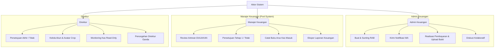

# Rangkuman & Dokumentasi Sistem Aplikasi RAB PT SBK

Aplikasi **Rancangan Anggaran Biaya (RAB)** PT Sertifikasi Bermutu Ketenagalistrikan (PT SBK) adalah sistem informasi finansial berbasis web. Sistem ini dirancang untuk mendigitalisasi, mengotomatisasi, dan mengamankan seluruh siklus hidup pengelolaan anggaran pengeluaran perusahaan secara transparan, akurat, dan akuntabel.

---

## 1. Aktor Sistem & Kontrol Akses (RBAC)

Aplikasi ini menggunakan sistem *Role-Based Access Control* (RBAC) yang membagi pengguna ke dalam tiga peran utama dengan hak akses yang terproteksi secara ketat di tingkat controller:



### 🔑 Rincian Peran & Hak Akses
1. **Admin Keuangan (`admin_keuangan`)**
   - **Tanggung Jawab:** Operasional harian anggaran dan pembayaran lapangan.
   - **Hak Akses:**
     - Membuat pengajuan RAB melalui 5 skema pengeluaran dinamis.
     - Menyunting data RAB berstatus `DRAFT`, `DITOLAK`, dan `DIAJUKAN`.
     - Menghapus RAB berstatus `DRAFT` dan `DIAJUKAN`.
     - Mengirim notifikasi WhatsApp pengajuan langsung ke atasan.
     - Merealisasikan pembayaran RAB yang berstatus `DISETUJUI` dengan mengunggah bukti bayar transfer (maksimal 100KB).
     - Menambahkan komentar diskusi pada detail RAB.
     - Mengekspor cetak PDF fisik pengajuan RAB tunggal.
     - *Batasan:* Tidak diizinkan mengakses menu Arus Kas (`/cash-flow`) dan Buku Kas Masuk demi objektivitas.
2. **Manajer Keuangan (`manajer_keuangan`)**
   - **Tanggung Jawab:** Verifikasi awal anggaran dan manajemen likuiditas kas operasional.
   - **Hak Akses:**
     - Melihat antrean pengajuan RAB berstatus `DIAJUKAN` di dashboard bersama (*Pool System*).
     - Memberikan persetujuan Tahap 1 (status naik menjadi `DISETUJUI_MANAJER`) atau melakukan penolakan dengan menyertakan alasan revisi.
     - Menginput transaksi **Dana Masuk** dan **Saldo Awal** secara manual di Buku Arus Kas.
     - Mengekspor rekapitulasi laporan arus kas bulanan ke PDF.
     - Menambahkan komentar di panel diskusi detail RAB.
3. **Direktur (`direktur`)**
   - **Tanggung Jawab:** Keputusan finansial akhir, audit global, dan tata kelola akun.
   - **Hak Akses:**
     - Memberikan persetujuan akhir (status naik menjadi `DISETUJUI`) atau penolakan pada RAB berstatus `DISETUJUI_MANAJER`.
     - Memantau Buku Arus Kas dalam mode **Read-Only** (hanya melihat, menyaring, dan mengunduh bukti tanpa hak manipulasi data).
     - Mengelola akun pengguna (pendaftaran, *toggle* status aktif, upload & crop avatar).
     - *Batasan:* Backend mencegah pendaftaran akun bertipe `direktur` lebih dari satu orang.

---

## 2. Fitur-Fitur Unggulan Aplikasi

- **Dashboard Analitik Premium:**
  - *Summary Widget:* Menampilkan total nominal pengajuan, realisasi bayar, *waiting approval*, dan jumlah ditolak.
  - *Double Line Chart:* Visualisasi perbandingan rencana anggaran vs realisasi aktual.
  - *Doughnut Chart Callout Lines:* Menggunakan plugin khusus untuk menggambar garis diagonal penunjuk data status RAB secara visual (tanpa legenda bertumpuk).
  - *Tren Kategori Dinamis:* Visualisasi kontribusi pengeluaran per kategori secara bulanan dengan filter interaktif yang dapat memfokuskan grafik pada kategori terpilih beserta garis trennya.
- **Skema 5 Kategori Pengeluaran Dinamis:**
  Tabel item pengisian akan beradaptasi secara otomatis di frontend dan database sesuai jenis pengeluaran:
  1. **Biaya Operasional:** Pembagian item ke dalam 5 kelompok (Honor Pencari Peserta, Uang Transport, Operasional Pembekalan, Operasional Uji, Honor Asesor) dengan antarmuka responsif (*table* di desktop dan *card-stack* di mobile).
  2. **Petty Cash:** Transaksi kas kecil (Volume × Harga Satuan + Admin Fee).
  3. **Biaya Gaji:** Pembayaran upah pegawai (Gaji pokok, uang makan, transport, lembur, dan nomor rekening).
  4. **Biaya Bulanan:** Tagihan rutin bulanan (Nominal tagihan + admin fee + ID Pelanggan).
  5. **Pembayaran PNBP:** Data setoran negara (Nama item, nomor agenda, level, tarif PNBP, dan nama perusahaan pembayar).
- **Sistem Keandalan Form Mulus:**
  - *Keep-Alive Ping:* Otomatis mengirim ping ringan ke server setiap 5 menit guna menjaga keaktifan sesi dan token CSRF (mencegah error `419 Page Expired`).
  - *Double-Submit Guard:* Menonaktifkan tombol submit seketika diklik dan menampilkan animasi loading spinner agar data tidak terkirim ganda.
  - *Pembersihan DOM Dinamis:* Menghapus elemen input yang tidak aktif agar tidak memicu validasi `required` yang tersembunyi.
- **Buku Arus Kas & Penguncian Permanen:**
  - Integrasi otomatis: Ketika Admin mengunggah bukti bayar RAB, sistem otomatis mencatatkan entri **Dana Keluar** (Kredit) pada arus kas.
  - Demi keamanan audit (*ledger immutability*), transaksi arus kas dan pembayaran yang telah berstatus `SELESAI` dikunci secara permanen dan tidak dapat diedit atau dihapus.
- **WhatsApp Share Notification:**
  - Tombol berbagi pesan WhatsApp instan yang menyusun pesan terformat rapi berisi rincian RAB, nominal angka, nominal terbilang dalam bahasa Indonesia, dan link persetujuan langsung.
- **Penstabil Gulir Halaman:**
  - Penambahan fragmen URL `#riwayat-table` pada tombol navigasi halaman agar fokus gulir browser tidak melompat kembali ke atas saat pengguna berpindah halaman tabel.
- **Preview & Unduh Bukti Instan:**
  - Deteksi jenis file cerdas di modal pratinjau (PDF dibuka lewat iframe, gambar dibuka lewat viewer gambar responsif), dilengkapi tombol unduh langsung yang menggunakan pengarah berkas aman dari server.

---

## 3. Alur Kerja Utama Sistem (Workflows)

### 3.1 State Machine Status RAB

```text
[DRAFT] ──(Ajukan RAB)──► [DIAJUKAN]
                              │
                              ├──(Tolak Manajer)──► [DITOLAK]
                              │
                              └──(Setujui Manajer)─► [DISETUJUI_MANAJER]
                                                          │
                                                          ├──(Tolak Direktur)──► [DITOLAK]
                                                          │
                                                          └──(Setujui Direktur)─► [DISETUJUI]
                                                                                      │
                                                                             (Upload Bukti Bayar)
                                                                                      │
                                                                                      ▼
                                                                                  [SELESAI]
```

### 3.2 Alur Persetujuan & Mitigasi Race Condition (Pool System)
Semua Manajer Keuangan memiliki antrean verifikasi yang sama. Guna menghindari persetujuan ganda secara bersamaan (*double approval*), sistem membungkus logika di controller dengan **Database Transactions** dan **State Checking**:

1. Request approval pertama kali mengunci baris data (`select for update`).
2. Server melakukan verifikasi apakah status RAB saat ini masih `DIAJUKAN`.
3. Jika YA, status diperbarui ke `DISETUJUI_MANAJER` dan transaksi di-commit.
4. Jika TIDAK (misalnya sudah diproses oleh manajer lain beberapa milidetik sebelumnya), transaksi di-rollback dan server memunculkan pesan peringatan informatif.

---

## 4. Struktur Database & Relasi Tabel

Aplikasi ini menggunakan basis data relasional MySQL dengan struktur tabel ternormalisasi.

### 📊 Diagram Relasi Database (ERD - Mermaid)

```mermaid
erDiagram
    USERS ||--o{ RABS : "membuat (user_id)"
    USERS ||--o{ RAB_APPROVALS : "memproses (user_id)"
    USERS ||--o{ RAB_PAYMENTS : "membayar (paid_by)"
    USERS ||--o{ CASH_FLOWS : "mencatat (created_by)"
    USERS ||--o{ REPORT_EXPORTS : "mengekspor (exported_by)"
    USERS ||--o{ AUDIT_LOGS : "memicu (user_id)"
    USERS ||--o{ RAB_DISCUSSIONS : "mengirim (user_id)"
    USERS ||--o{ RAB_NOTIFICATIONS : "menerima (user_id)"

    EXPENSE_TYPES ||--o{ RABS : "kategori (expense_type_id)"

    RABS ||--o{ OPERATIONAL_EXPENSE_ITEMS : "memiliki (rab_id)"
    RABS ||--o{ PETTY_CASH_ITEMS : "memiliki (rab_id)"
    RABS ||--o{ SALARY_EXPENSE_ITEMS : "memiliki (rab_id)"
    RABS ||--o{ MONTHLY_EXPENSE_ITEMS : "memiliki (rab_id)"
    RABS ||--o{ PNBP_EXPENSE_ITEMS : "memiliki (rab_id)"
    RABS ||--o{ RAB_APPROVALS : "memiliki (rab_id)"
    RABS ||--o{ RAB_DISCUSSIONS : "memiliki (rab_id)"
    RABS ||--o{ RAB_NOTIFICATIONS : "memiliki (rab_id)"
    RABS ||--o{ AUDIT_LOGS : "memiliki (rab_id)"
    RABS ||--o{ CASH_FLOWS : "referensi (rab_id)"
    RABS ||--o1 RAB_PAYMENTS : "memiliki (rab_id)"

    RAB_PAYMENTS ||--o1 CASH_FLOWS : "membuat (payment_id)"
```

---

### 📂 Struktur Tabel & Atribut Detil

#### 1. Keamanan & Hak Akses
*   **`users`**: Menyimpan kredensial dan peran pengguna.
    *   `id` (BIGINT, PK)
    *   `name` (VARCHAR)
    *   `email` (VARCHAR, Unique)
    *   `password` (VARCHAR)
    *   `role` (ENUM: `admin_keuangan`, `manajer_keuangan`, `direktur`)
    *   `phone_number` (VARCHAR, Nullable)
    *   `avatar` (VARCHAR, Nullable)
    *   `is_active` (BOOLEAN, Default `true`)
    *   `remember_token` (VARCHAR, Nullable)
    *   `timestamps`, `deleted_at`

#### 2. Tabel Utama Anggaran
*   **`expense_types`**: Referensi 5 kategori pengeluaran utama.
    *   `id` (BIGINT, PK)
    *   `name` (VARCHAR) - *Contoh: Biaya Gaji, Pembayaran PNBP*
    *   `code` (VARCHAR, Unique) - *Contoh: operasional, petty_cash, gaji, bulanan, pnbp*
    *   `description` (TEXT, Nullable)
    *   `is_active` (BOOLEAN, Default `true`)
    *   `timestamps`, `deleted_at`
*   **`rabs`**: Menyimpan data utama dokumen pengajuan RAB.
    *   `id` (BIGINT, PK)
    *   `rab_number` (VARCHAR, Unique) - *Format: XXX/RAB/SBK/ROMAN_BULAN/TAHUN*
    *   `request_date` (DATE)
    *   `period_month` (VARCHAR, Nullable)
    *   `period_year` (VARCHAR, Nullable)
    *   `user_id` (BIGINT, FK ke `users.id`)
    *   `expense_type_id` (BIGINT, FK ke `expense_types.id`)
    *   `description` (TEXT, Nullable)
    *   `total_amount` (DECIMAL(15,2), Default `0.00`)
    *   `status` (ENUM: `draft`, `diajukan`, `disetujui_manajer`, `disetujui`, `ditolak`, `selesai`)
    *   `submitted_at`, `approved_by_manager_at`, `approved_by_director_at`, `completed_at` (TIMESTAMP, Nullable)
    *   `timestamps`, `deleted_at`

#### 3. Rincian Item Anggaran (Dinamis per Kategori)
*   **`operational_expense_items`** (Kategori: Biaya Operasional)
    *   `id` (BIGINT, PK)
    *   `rab_id` (BIGINT, FK ke `rabs.id`)
    *   `group_type` (ENUM) - *1 s.d 5 jenis honor/operasional kelistrikan*
    *   `need_name` (VARCHAR)
    *   `description` (TEXT, Nullable)
    *   `volume` (DECIMAL(12,2))
    *   `unit` (VARCHAR)
    *   `unit_price` (DECIMAL(15,2))
    *   `total` (DECIMAL(15,2)) - *Rumus: volume × unit_price*
    *   `timestamps`
*   **`petty_cash_items`** (Kategori: Petty Cash)
    *   `id` (BIGINT, PK)
    *   `rab_id` (BIGINT, FK ke `rabs.id`)
    *   `expense_name` (VARCHAR)
    *   `description` (TEXT, Nullable)
    *   `transaction_date` (DATE)
    *   `nominal` (DECIMAL(15,2))
    *   `receipt_path` (VARCHAR, Nullable)
    *   `timestamps`
*   **`salary_expense_items`** (Kategori: Biaya Gaji)
    *   `id` (BIGINT, PK)
    *   `rab_id` (BIGINT, FK ke `rabs.id`)
    *   `employee_name` (VARCHAR)
    *   `position` (VARCHAR, Nullable)
    *   `bank_account_number` (VARCHAR)
    *   `bank_name` (VARCHAR)
    *   `attendance_days` (INTEGER)
    *   `salary_nominal` (DECIMAL(15,2))
    *   `meal_allowance` (DECIMAL(15,2))
    *   `transport_allowance` (DECIMAL(15,2))
    *   `overtime` (DECIMAL(15,2))
    *   `total_salary` (DECIMAL(15,2)) - *Rumus: salary_nominal + (attendance_days × (meal_allowance + transport_allowance)) + overtime*
    *   `description` (TEXT, Nullable)
    *   `timestamps`
*   **`monthly_expense_items`** (Kategori: Biaya Bulanan)
    *   `id` (BIGINT, PK)
    *   `rab_id` (BIGINT, FK ke `rabs.id`)
    *   `payment_name` (VARCHAR)
    *   `customer_id` (VARCHAR)
    *   `account_holder` (VARCHAR)
    *   `period` (VARCHAR)
    *   `description` (TEXT, Nullable)
    *   `bill_nominal` (DECIMAL(15,2))
    *   `admin_fee` (DECIMAL(15,2))
    *   `total_payment` (DECIMAL(15,2)) - *Rumus: bill_nominal + admin_fee*
    *   `timestamps`
*   **`pnbp_expense_items`** (Kategori: Pembayaran PNBP)
    *   `id` (BIGINT, PK)
    *   `rab_id` (BIGINT, FK ke `rabs.id`)
    *   `item_name` (VARCHAR)
    *   `agenda_number` (VARCHAR)
    *   `level` (VARCHAR)
    *   `tarif_pnbp` (DECIMAL(15,2))
    *   `company_name` (VARCHAR)
    *   `timestamps`

#### 4. Approval, Pembayaran, dan Finansial
*   **`rab_approvals`**: Catatan riwayat persetujuan bertingkat.
    *   `id` (BIGINT, PK)
    *   `rab_id` (BIGINT, FK ke `rabs.id`)
    *   `user_id` (BIGINT, FK ke `users.id`)
    *   `role` (ENUM: `manajer_keuangan`, `direktur`)
    *   `approval_level` (ENUM: `manager`, `director`)
    *   `status` (ENUM: `approved`, `rejected`)
    *   `notes` (TEXT, Nullable)
    *   `approved_at` / `rejected_at` (TIMESTAMP, Nullable)
    *   `timestamps`
*   **`rab_payments`**: Realisasi transfer bank bukti bayar.
    *   `id` (BIGINT, PK)
    *   `rab_id` (BIGINT, FK ke `rabs.id`)
    *   `paid_by` (BIGINT, FK ke `users.id`)
    *   `payment_date` (DATE)
    *   `paid_amount` (DECIMAL(15,2))
    *   `payment_method` (VARCHAR)
    *   `recipient_account` (VARCHAR, Nullable)
    *   `recipient_name` (VARCHAR, Nullable)
    *   `proof_file_path` (VARCHAR)
    *   `notes` (TEXT, Nullable)
    *   `timestamps`
*   **`cash_flows`**: Buku arus kas keluar dan masuk.
    *   `id` (BIGINT, PK)
    *   `rab_id` (BIGINT, FK ke `rabs.id`, Nullable)
    *   `payment_id` (BIGINT, FK ke `rab_payments.id`, Nullable)
    *   `transaction_date` (DATE)
    *   `type` (ENUM: `saldo_awal`, `dana_masuk`, `dana_keluar`)
    *   `description` (TEXT)
    *   `debit` (DECIMAL(15,2), Default `0.00`) - *Untuk uang masuk*
    *   `credit` (DECIMAL(15,2), Default `0.00`) - *Untuk uang keluar*
    *   `balance` (DECIMAL(15,2), Default `0.00`) - *Saldo berjalan*
    *   `proof_file` (VARCHAR, Nullable)
    *   `created_by` (BIGINT, FK ke `users.id`)
    *   `timestamps`
*   **`report_exports`**: Riwayat cetak / ekspor laporan.
    *   `id` (BIGINT, PK)
    *   `exported_by` (BIGINT, FK ke `users.id`)
    *   `report_type` (VARCHAR)
    *   `start_date` / `end_date` (DATE)
    *   `file_path` (VARCHAR, Nullable)
    *   `format` (ENUM: `pdf`, `excel`)
    *   `total_debit` / `total_credit` / `ending_balance` (DECIMAL(15,2))
    *   `timestamps`

#### 5. Komunikasi Kolaboratif & Log Audit
*   **`rab_discussions`**: Panel chat/catatan diskusi internal pada tiap modal RAB.
    *   `id` (BIGINT, PK)
    *   `rab_id` (BIGINT, FK ke `rabs.id`)
    *   `user_id` (BIGINT, FK ke `users.id`)
    *   `message` (TEXT)
    *   `timestamps`
*   **`rab_notifications`**: Log notifikasi sistem yang dikirimkan ke pengguna.
    *   `id` (BIGINT, PK)
    *   `rab_id` (BIGINT, FK ke `rabs.id`)
    *   `user_id` (BIGINT, FK ke `users.id`)
    *   `title` (VARCHAR)
    *   `message` (TEXT)
    *   `read_at` (TIMESTAMP, Nullable)
    *   `timestamps`
*   **`audit_logs`**: Rekaman aktivitas perubahan data vital (*Audit Trail*).
    *   `id` (BIGINT, PK)
    *   `user_id` (BIGINT, FK ke `users.id`, Nullable)
    *   `rab_id` (BIGINT, FK ke `rabs.id`, Nullable)
    *   `action` (VARCHAR)
    *   `description` (TEXT)
    *   `old_values` (JSON, Nullable)
    *   `new_values` (JSON, Nullable)
    *   `ip_address` (VARCHAR, Nullable)
    *   `user_agent` (TEXT, Nullable)
    *   `timestamps`

---

## 5. Ringkasan Kunci untuk Sidang / Audit
1. **Pemisahan 5 Tabel Rincian:** Dirancang agar basis data ternormalisasi (memenuhi **Third Normal Form - 3NF**), menghemat memori penyimpanan karena tidak ada kolom bernilai kosong (*nullable overloading*), dan memudahkan validasi data spesifik di tingkat model.
2. **Keandalan Arus Kas:** Mutasi kas masuk diinput oleh Manajer Keuangan secara manual, sedangkan mutasi kas keluar **tercatat otomatis oleh sistem** saat Admin Keuangan mengunggah bukti bayar RAB yang disetujui. Data ini dikunci mati demi akurasi audit.
3. **Pencegahan Bentrokan Data (Race Conditions):** Menggunakan `DB::beginTransaction()` dan state-validation di controller untuk memastikan satu RAB tidak diproses dua kali oleh manajer berbeda dalam hitungan milidetik.
4. **Pembatasan File Bukti Transfer (Maksimal 100KB):** Menghemat beban bandwidth dan penyimpanan server jangka panjang tanpa mengurangi kejelasan dokumen transfer.
